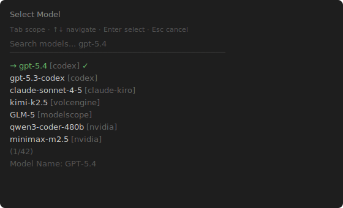
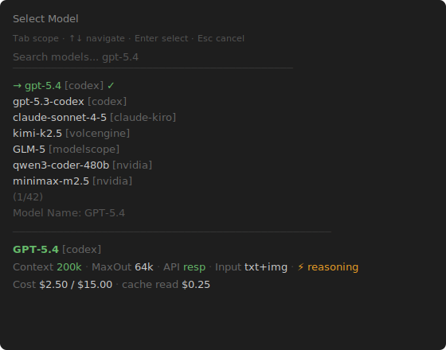

# pi-model-selector-x

ModelSelectorX enhances pi's native `/model` selector with a detail pane showing context window, cost, input modalities, API protocol, and reasoning capability.

It patches the built-in `/model` view.

## WARNING

This extension patches the `/model` internals and could break if pi updates in an incompatible way. I chose this approach rather than re-implementing the internal model selector rendering so that it would automatically update the rendering.

## Features

- Bottom detail pane for the selected model showing full metadata
- Context window size (e.g. `200k`, `1M`)
- Max output tokens
- API protocol (`resp` / `comp` / `anth`)
- Input modalities (`txt`, `txt+img`, `txt+img+aud`)
- Reasoning capability indicator
- Cost breakdown (input / output / cache read / cache write)
- Free model detection

## Screenshots

<table>
  <tr>
    <th width="50%">Before</th>
    <th width="50%">After</th>
  </tr>
  <tr>
    <td width="50%"></td>
    <td width="50%"></td>
  </tr>
  <tr>
    <td>The built-in selector shows only <code>model-id [provider] ✓</code>. No context window, cost, or capability info.</td>
    <td>ModelSelectorX adds a detail pane with context window, max output, API protocol, input modalities, reasoning indicator, and cost breakdown.</td>
  </tr>
</table>

## Detail Pane

The detail pane appears below the model list and shows:

| Field | Source | Example |
|-------|--------|---------|
| Context | `model.contextWindow` | `200k` |
| Max Output | `model.maxTokens` | `64k` |
| Protocol | `model.api` | `resp` / `comp` / `anth` |
| Input | `model.input` | `txt+img` / `txt` |
| Reasoning | `model.reasoning` | `⚡ reasoning` |
| Cost | `model.cost` | `$2.50 / $15.00` / `free` |
| Cache | `model.cost.cacheRead/Write` | `$0.25` |

### Protocol abbreviations

| Short | Full |
|-------|------|
| `resp` | OpenAI Responses API |
| `comp` | OpenAI Completions API |
| `anth` | Anthropic Messages API |

## Installation

### npm

```bash
pi install npm:pi-model-selector-x
```

To try it for one run without adding it to your settings:

```bash
pi -e npm:pi-model-selector-x
```

### git

```bash
pi install git:github.com/Dwsy/pi-model-selector-x
```

## Usage

After installation, open the model selector with the built-in keybinding or:

```text
/model
```

## Notes

- Tested with pi 0.70.2
- ModelSelectorX patches the native `/model` path, so the built-in slash command and model hotkey keep using pi's own navigation and selection flow.
- ModelSelectorX relies on private model-selector internals, so upstream pi changes may require ModelSelectorX updates.
